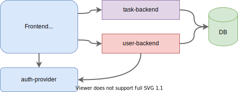

# Athene
A little todo / bug tracker for my personal projects

# Goal
Writting a bug-tracker is a very good way to try out various ways of implementing a application the most people in the industry work with on a daily basis. 

# Architecture

# Technologies 
Everything should run in docker and a docker-compose file should setup the whole project to make it easy for development

## task backend:
* rust
  * actix-web
* mongodb

## user backend:
* tbd

## frontend:
* next.js
* later: WASM to make gRPC calls to the backend 	

## auth
* auth0
